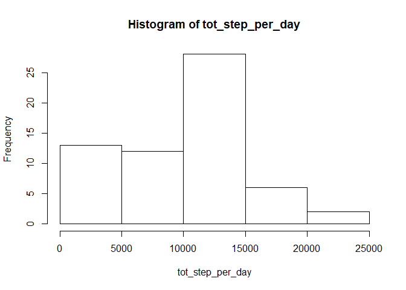
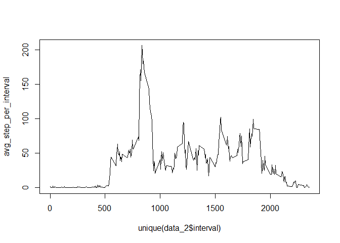
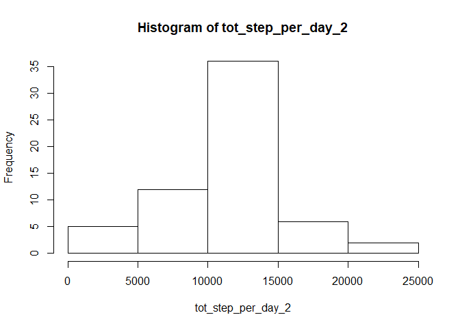
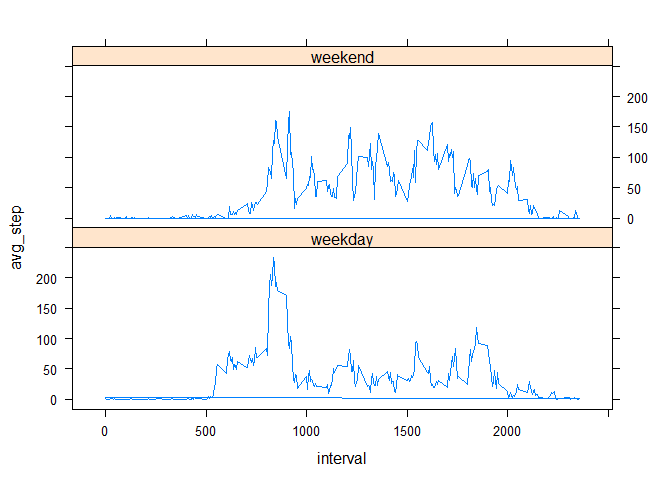

#Course Project 1

## Loading and preprocessing the data


```r
data<-read.csv("activity.csv",header=TRUE, sep=",", stringsAsFactors = FALSE)
library(lubridate)
library(dplyr)
library(ggplot2)
mydate<-data$date
mydate_2<-ymd(mydate)
data_2<-data
data_2$date<-mydate_2
tot_step_per_day<-with(data_2, tapply(steps, date, sum, na.rm=TRUE))
mean_step_per_day<-with(data_2, tapply(steps, date, mean, na.rm=TRUE))
med_step_per_day<-with(data_2, tapply(steps, date, median, na.rm=TRUE))
hist(tot_step_per_day, breaks = 7)
```

<!-- -->

## What is mean total number of steps taken per day?


```r
mean(tot_step_per_day)
```

```
## [1] 9354.23
```

```r
median(tot_step_per_day)
```

```
## [1] 10395
```

## What is the average daily activity pattern?

```r
avg_step_per_interval<-with(data_2, tapply(steps, interval, mean, na.rm=TRUE))
plot(unique (data_2$interval), avg_step_per_interval, type = "l")
```

<!-- -->

###The 5-minute interval that, on average, contains the maximum number of steps

```r
max_steps<-which(avg_step_per_interval==max(avg_step_per_interval))
avg_step_per_interval[max_steps]
```

```
##      835 
## 206.1698
```

## Imputing missing values

```r
data_3<-data_2
data_3$steps_2<-avg_step_per_interval
data_3$steps_3<-data_3$steps
missing<-which(is.na(data_3$steps))
data_4<-transform(data_3, steps_3=ifelse(is.na(steps), steps_2, steps_3))
```
### Comparing before and after imputing

```r
tot_step_per_day_2<-with(data_4, tapply(steps_3, date, sum, na.rm=TRUE))
mean(tot_step_per_day_2)
```

```
## [1] 10766.19
```

```r
mean(tot_step_per_day)
```

```
## [1] 9354.23
```

```r
median(tot_step_per_day)
```

```
## [1] 10395
```

```r
median(tot_step_per_day_2)
```

```
## [1] 10766.19
```
###Histogram of the total number of steps taken each day after missing values are imputed

```r
hist(tot_step_per_day_2, breaks = 7)
```

<!-- -->

## Are there differences in activity patterns between weekdays and weekends?


```r
data_4$day_of_week<-weekdays(data_4$date)
data_5<-data_4
data_5$day_of_week_2<-data_4$day_of_week
data_6<-transform(data_5, day_of_week_2= ifelse(day_of_week=="Saturday"|day_of_week=="Sunday", "weekend","weekday"))
library(lattice)
weekend_data<-filter(data_6,day_of_week_2=="weekend")
weekday_data<-filter(data_6,day_of_week_2=="weekday")
weekend_data$avg_step<-with(weekend_data, tapply(steps, interval, mean, na.rm=TRUE))
weekday_data$avg_step<-with(weekday_data, tapply(steps, interval, mean, na.rm=TRUE))
data_avg<-rbind(weekday_data, weekend_data)
xyplot(avg_step ~ interval |day_of_week_2, data = data_avg, layout=c(1,2), type="l")
```

<!-- -->


